# COMPARACIÓN DE TECNOLOGÍA CMOS y TTL

## Comparacion de de especificaciones 

| **Especificación**            | **CD4069 (CMOS)**                    | **74LS04 (TTL)**                     |
|--------------------------------|--------------------------------------|---------------------------------------|
| **Tecnología**                 | CMOS (Complementary Metal-Oxide Semiconductor) | TTL (Transistor-Transistor Logic)    |
| **Número de compuertas**       | 6 inversores                         | 6 inversores                          |
| **Tensión de alimentación ($V_{CC}$)** | 3 V a 15 V                          | 4.75 V a 5.25 V (típicamente 5 V)     |
| **Consumo de corriente**       | Muy bajo (µA en reposo)              | Mayor (mA en reposo)                  |
| **Velocidad de operación**     | Más lento que TTL                    | Más rápido que CMOS                   |
| **Corriente de salida**        | Baja (< 1 mA típicamente)            | Alta (hasta 24 mA máx. en salida baja)|
| **Margen de ruido**            | Mayor debido a la alta impedancia    | Menor debido a la baja impedancia     |
| **Tiempo de propagación ($t_{pd}$)**| Típicamente 50-200 ns                | Típicamente 10-25 ns                  |
| **Impedancia de entrada**      | Muy alta                             | Baja                                  |
| **Consumo dinámico**           | Bajo, depende de la frecuencia       | Alto, incluso a frecuencias bajas     |
| **Nivel lógico alto ($V_{OL}$)**   | ~70% de Vcc                          | 2.4 V mín.                            |
| **Nivel lógico bajo ($V_{OH}$)**   | ~30% de Vcc                          | 0.4 V máx.                            |
| **Compatibilidad lógica**      | Compatible con otras familias CMOS   | Compatible con otras familias TTL y algunas CMOS con adaptadores |
| **Aplicaciones típicas**       | Circuitos de bajo consumo, digitales simples | Circuitos de alta velocidad y cargas más pesadas |

## Circuitos equivalentes

1. Negador en BJT

Para este caso, se utilizó el modelo dado en la hoja de datos de la compuerta 74LS04, ya que el modelo más sencillo de compuerta negadora apenas era notorio la caída de tensión debido a las resistencias. 

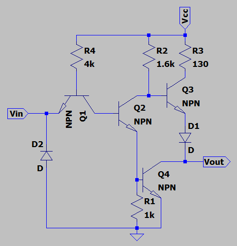

2. Negador en CMOS 

Se usa el modelo más comun de compuerta negadora en CMOS, donde en la salida esta la señal completa, no hay caida de tensión o es casi imperceptible.

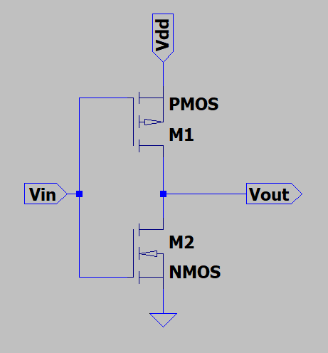

## Señal cuadrada 1kHz

### Simulaciones

1. Negador TTL 74LS04 

El circuito que se uso para las distintas simulaciones se puede ver a continuación:

Al aplicarle una señal cuadrada con 1KHz de frecuencia y amplitud 5V, se obtuvo la siguiente gráfica que relaciona la salida con la entrada.

En la anterior imagen se puede dar uno cuenta que el circuito efectivamente corresponde al de una compuerta lógica NOT, es decir, que invierte el valor de la señal de entrada.
Ahora, se gráfica la función de transferencia de este circuito, la cual se puede ver en la siguiente imagen.

De la función de transferencia se pueden obtener los siguientes valores:

+ $V_{IL} = 2.479V$
+ $V_{IH} = 2.509V$
+ $V_{OL} = 13.971mV$
+ $V_{OH} = 4.975V$

2. Negador CMOS CD4069

El circuito que se uso para las distintas simulaciones se puede ver a continuación:

Al aplicarle una señal cuadrada con 1KHz de frecuencia y amplitud 5V, se obtuvo la siguiente gráfica que relaciona la salida con la entrada.

En la anterior imagen se puede dar uno cuenta que el circuito efectivamente corresponde al de una compuerta lógica NOT, es decir, que invierte el valor de la señal de entrada.
Ahora, se gráfica la función de transferencia de este circuito, la cual se puede ver en la siguiente imagen.

De la función de transferencia se pueden obtener los siguiente valores:

+ $V_{IL} = 2.508V$
+ $V_{IH} = 2.526V$
+ $V_{OL} = 2.524mV$
+ $V_{OH} = 5V$

### Experimentalmente 
1. Negador TTL 74LS04 

Al observar la salida de la compuerta es notorio que hay una caída de tensión bastante grande, lo que confirma el modelo equivalente de transistores usado anteriormente.

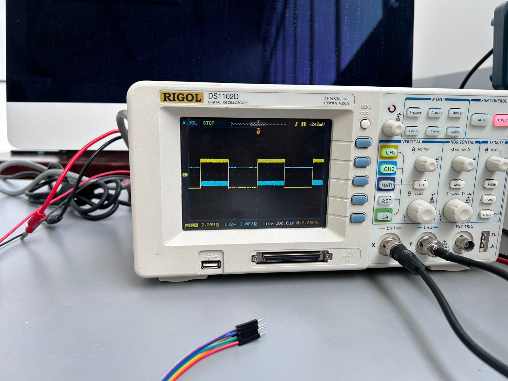

2. Negador CMOS CD4069

Para este caso, aún existe una pequeña caída de tensión a la salida de la compuerta, además de ser bastante menor comparada a la del negador en TTL, por lo que es un resultado aceptable.
Esto se sustenta con el $V_{OL}$ encontrado mediante la función de transferencia, el valor para este parámetro tiene un menor margen con respecto al negador en TTL dando como resultado que la caída de tensión observada sea menor

## Tiempos de subida y bajada, retardo y tiempos de almacenamiento

   - Tiempo de Retardo 

  
 El tiempo de retardo o tiempo o propagation delay ($t_p$), se refiere al tiempo que tarda una señal en propagarse en la compuerta, desde que entra hasta que sale, para esto se toman intervalos desde el momento en que la señal de entrada alcanza el 50% de la tensión, hasta que la señal de salida alcanza el nivel equivalente. 

   
   - Tiempos de almacenamiento

   Aplica especialmente a compuertas TTL, ya que son construidas en BJT, se refiere al tiempo en el que el transistor deja totalmente la zona de saturación antes de pasar a la zona de corte, esto se debe a que el transistor no responde de forma inmediata y permanece en saturación antes de hacer el cambio, claro está CMOS también se ve afectado por lo mismo, pero sus tiempos de respuesta son más rápidos. 

### Simulaciones

Para esto se usaron diversas directivas en LTspice con las que se obtuvieron los tiempos de subida y bajada.
Estas se pueden ver a continuación:

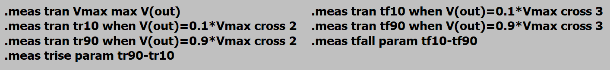

1. Negador TTL 74LS04 

   Los resultados para esta compuerta fueron:

   - Tiempo de subida

      El resultado obtenido mediante la simulación fue de:

      $t_{r} = 8.54511x10^{-7}s$

   - Tiempo de bajada 

      El resultado obtenido mediante la simulación fue de:

      $t_{f} = 1.53357x10^{-7}s$

2. Negador CMOS CD4069

   Aplicando las mismas directivas, pero en este caso para el CMOS CD4069 se cálculo lo siguiente:

   - Tiempo de subida

      El resultado obtenido mediante la simulación fue de:

      $t_{r} = 1.79417x10^{-7}s$

   - Tiempo de bajada 

      El resultado obtenido mediante la simulación fue de:

      $t_{f} = 2.02093x10^{-7}s$

Por otro lado, los tiempos de propagación del retardo ($t_{phl}$ y $t_{plh}$) se encontraron mediante las siguientes directivas en LTspice.

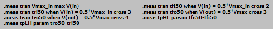

Los cálculos obtenidos mediante este método se pueden ver a continuación:

1. Negador TTL 74LS04

   - $t_{phl} = 450013ns$
   - $t_{plh} = 550017ns$

2. Negador CMOS CD4069

   - $t_{phl} = 450074ns$
   - $t_{plh} = 550164ns$

### Experimentalmente

1. Negador TTL 74LS04 

   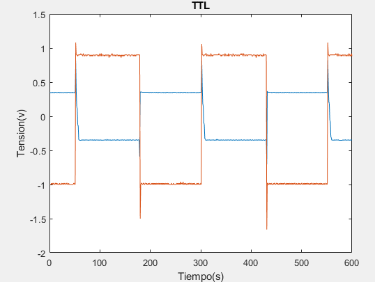

   El eje X esta en microsegundos

   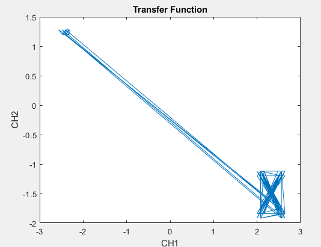

2. Negador CMOS CD4069

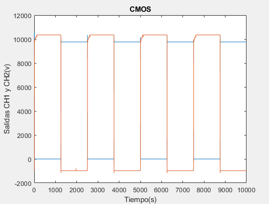

El eje Y esta representando 1 milivoltio por cada punto, solo que lo olvidamos a la hora de poner el titulo de ese eje, asi mismo el eje X estaria en el rango d elos nano segundos

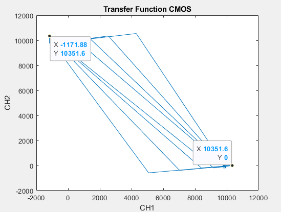

Para obtener los datos de tiempos de subida y tiempos de bajada experimentalmente se planteó usar la herramienta de Matlab, sacar un % de los valores que respresentan las pendientes que corresponden, pero, los datos obtenidos experimentalmente no permitieron lograr esto, no obtuvimos la suficiente cantidad de datos del osciloscopio. 

## Fan-In y Fan-Out 

 - Fan-In: Para ambos casos, el Fan_In será de uno, ya que las compuertas solo pueden manejar una señal de entrada a la vez, al intentar ingresar una segunda señal, a la salida solo se verá una señal con ruido. 

1. Negador TTL 74LS04 

- Fan-Out 
   Se puede calcular usando los datos de su datasheet, en donde se divide la corriente de salida de nivel bajo entre la corriente de entrada de nivel bajo. 
   
   $Fan-Out = \frac{I_{LO}}{I_{LI}} = \frac{8 mA}{0.4 mA} = 20$

2. Negador CMOS CD4069

   Para este caso, también se aprovecharán los datos de la datasheet, pero se divide la corriente de salida en nivel alto entre la corriente de entrada. 
   
   $Fan-Out = \frac{I_{HO}}{I_{IN}} = \frac{0.88 mA}{ 10 um} = 80$

## Determinación de potencia 

Aunque para la disipación total de la compuerta hay que tener en cuenta la corriente estatica (sin nada conectado), la corriente que esta consume es muy baja, por lo que solo se toma en cuenta la corriente dinámica (al usar la compuerta), lo que da una potencia de 0.26W (canal 1). 

 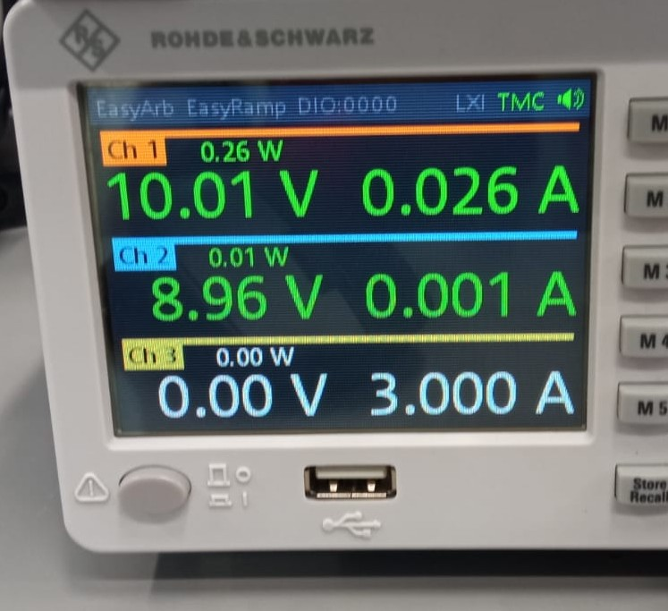

## Circuito propuesto

Se implemento un circuito sencillo en el que, al introducir una señal de entrada, la compuerta al ser una negadora apagaba el led, por lo que al estar sin la señal se mantiene prendido. 

https://github.com/user-attachments/assets/32fcef04-ce6f-4e2a-9446-2078a086190f

## Oscilador en anillo

Se montan dos circuitos diferentes en anillo haciendo uso del negador CMOS, exactamente se realizó una configuración con tres y cinco puertas.
Sus respectivas simulaciones se pueden observar a continuación:

### Simulaciones

Se empleo una directa de LTspice en la que se indicaba una condición inicial en el circuito, está consiste en la alimentación inicial de un pulso de amplitud 5V. Posteriormente, el circuito oscilaría a partir de esta señal inicial.

1. Oscilador con 3 compuertas

   El circuito empleado en la simulación fue el siguiente:

   

   La frecuencia medida durante la ejecución de la simulación fue de $1.68MHz$, podemos verla en la siguiente imagen.

   

   Es bueno resaltar que la forma de onda en la simulación es cuadrada debido a la condición inicial mientras que en la prueba experimental dicha forma de onda será totalmente distinta debido a que no se alimentará al circuito con una señal inicial.
   Esta condición inicial se llevó a cabo en LTspice porque el tiempo de ejecución de la simulación era demasiado alto debido a que no había una señal inicial, sino que era solamente ruido.

2. Oscilador con 5 compuertas

   El circuito empleado en la simulación fue el siguiente:

   

   La frecuencia medida durante la ejecución de la simulación fue de $751KHz$, podemos verla en la siguiente imagen.

   

   Al igual que en la anterior configuración la forma de onda en la simulación es cuadrada debido a la condición inicial; sin embargo, durante el montaje experimental la onda cambiará porque no se le colocará ninguna señal inicial.

### Resultados Experimentales

1. Oscilador con 3 compuertas

2. Oscilador con 5 compuertas 

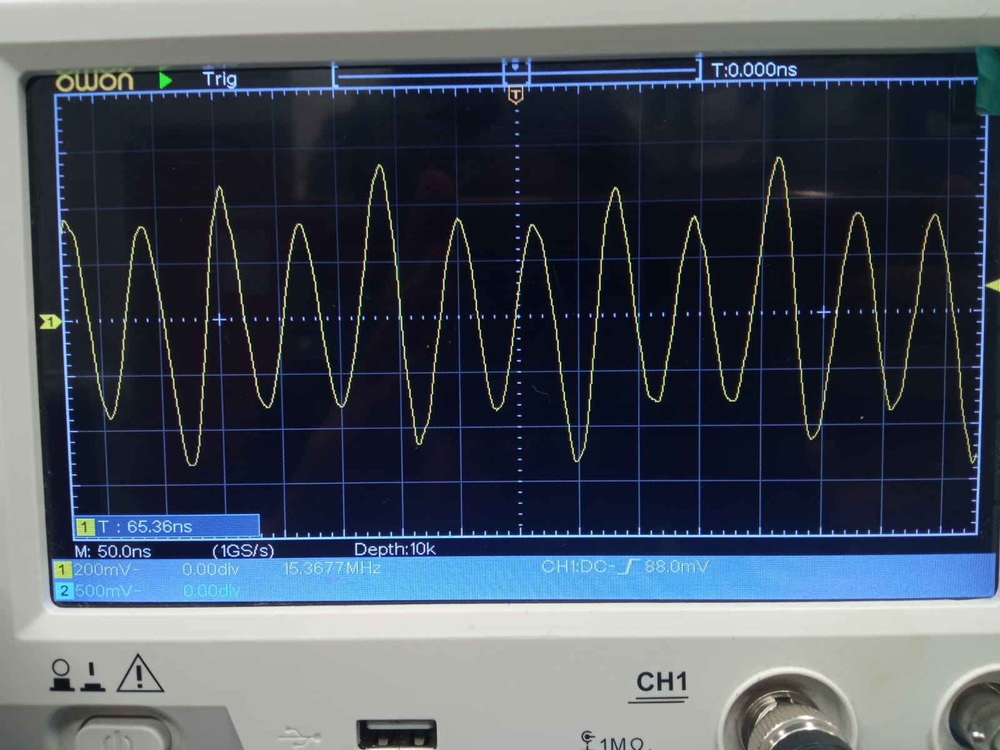

Se puede observar que una de las diferencias fundamentales entre ambas configuraciones es que la frecuencia se reduce al conectar más compuertas negadoras en el anillo de oscilación, esto se refuerza con los datos obtenidos de las simulaciones.

Por otra parte, vemos que hay una variación significativa en cuanto a la frecuencia medida experimentalmente, esto se puede deber a que hubo una mala conexión durante el montaje del circuito en ambos casos. No obstante, es bueno tener en cuenta que los resultados reales en la gran mayoría de ocasiones cambian respecto a su cálculo teórico o simulación.

Además, la señal que se observá en ambos casos se parece a una forma de onda entre una señal sinusoidal y una de ruido. Al mirar el comportamiento completo mostrado por el osciloscopio uno se puede dar cuenta que la señal se asemeja mucho más a la forma de onda de una señal con ruido, este aspecto tiene sentido porque a ninguna de las dos configuraciones se le está aplicando un pulso inicial de 5V a diferencia de las simulaciones.
