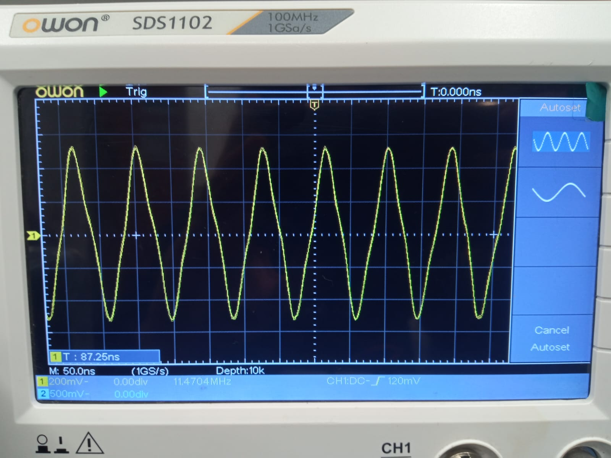

# COMPARACIÓN DE TECNOLOGÍA CMOS y TTL

## Comparacion de de especificaciones 

| **Especificación**            | **CD4069 (CMOS)**                    | **74LS04 (TTL)**                     |
|--------------------------------|--------------------------------------|---------------------------------------|
| **Tecnología**                 | CMOS (Complementary Metal-Oxide Semiconductor) | TTL (Transistor-Transistor Logic)    |
| **Número de compuertas**       | 6 inversores                         | 6 inversores                          |
| **Tensión de alimentación ($V_{CC}$)** | 3 V a 15 V                          | 4.75 V a 5.25 V (típicamente 5 V)     |
| **Consumo de corriente**       | Muy bajo (µA en reposo)              | Mayor (mA en reposo)                  |
| **Velocidad de operación**     | Más lento que TTL                    | Más rápido que CMOS                   |
| **Corriente de salida**        | Baja (< 1 mA típicamente)            | Alta (hasta 24 mA máx. en salida baja)|
| **Margen de ruido**            | Mayor debido a la alta impedancia    | Menor debido a la baja impedancia     |
| **Tiempo de propagación ($t_{pd}$)**| Típicamente 50-200 ns                | Típicamente 10-25 ns                  |
| **Impedancia de entrada**      | Muy alta                             | Baja                                  |
| **Consumo dinámico**           | Bajo, depende de la frecuencia       | Alto, incluso a frecuencias bajas     |
| **Nivel lógico alto ($V_{OL}$)**   | ~70% de Vcc                          | 2.4 V mín.                            |
| **Nivel lógico bajo ($V_{OH}$)**   | ~30% de Vcc                          | 0.4 V máx.                            |
| **Compatibilidad lógica**      | Compatible con otras familias CMOS   | Compatible con otras familias TTL y algunas CMOS con adaptadores |
| **Aplicaciones típicas**       | Circuitos de bajo consumo, digitales simples | Circuitos de alta velocidad y cargas más pesadas |

## Circuitos equivalentes

1. Negador en BJT

Para este caso, si utilizo el modelo dado en la hoja de datos de la compuerta 74LS04, ya que el modelo mas sencillo de compuerta negadora, apenas era notoria la caida de tension debido a las resistencias. 

2. Negador en CMOS 

Se usa el modelo mas comun de compuerta negadora en CMOS, donde en la salida esta la señal completa, no hay caida de tension o es casi imperceptible.

## Señal cuadrada 1kHz

### Simulaciones

1. Negador TTL 74LS04 

2. Negador CMOS CD4069

### Experimentalmente 
1. Negador TTL 74LS04 

Al observar la salida de la compuerta es notorio que hay una caida de tension bastante grande, lo que confirma el modelo equivalente usado anteriormente.

2. Negador CMOS CD4069

Para este caso, aun existe una pequeña caida de tension a la salida de la compuerta, ademas de ser bastante menor comparada a la del negador en TTL, por lo que es un resultado aceptable.

## Tiempos de subida y bajada, retardo y tiempos de almacenamiento

   - Tiempo de Retardo 

   El tiempo de retardo o tiempo o propagatin delay ($t_p$), se refiere al tiempo que tarda una señal en propagarse en la compuerta, desde que entra hasta que sale, para esto se toman intervalos desde el momento en que la señal de entrada alcanza el 50% de la tension, hasta que la señal de salida alcanza el nivel equivalente. 

   
   - Tiempos de almacenamiento

   Aplica especialmente a compuertas TTL ya que son contruidas en BJT, se refiere al tiempo en el que el transistor deja totalmente la zona de saturancion antes de pasar a la zonas de corte, esto se debe a que el transistor no responde de forma inmediata y permanece en saturacion antes de hacer el cambio, claro esta CMOS tambien se ve afectado por lo mismo, pero sus tiempos de respuesta son mas rapidos. 

### Simulaciones 
1. Negador TTL 74LS04 

   - Tiempo de subida

   - Tiempo de bajada 

2. Negador CMOS CD4069

   - Tiempo de subida

   - Tiempo de bajada 

### Experimentalmente

1. Negador TTL 74LS04 

   - Tiempo de subida

   - Tiempo de bajada 

2. Negador CMOS CD4069

   - Tiempo de subida

   - Tiempo de bajada 

## Fan-In y Fan-Out 

1. Negador TTL 74LS04 
   - Fan-In 

   - Fan-Out 
   Se puede calcular usando los de su datasheet, en donde se divide la corriente de salida de nivel bajo  entre la corriente de entrada de nivel bajo. 

   $$
   Fan-Out = \frac{I_{LO}}{I_{LI}} = \frac{8 mA}{0.36 mA} = 2
   $$

2. Negador CMOS CD4069

## Determinacion de potencia 

## Circuito propuesto

## Oscilador en anillo

1. Oscilador con 3 compuertas

2. Oscilador con 5 compuertas 

